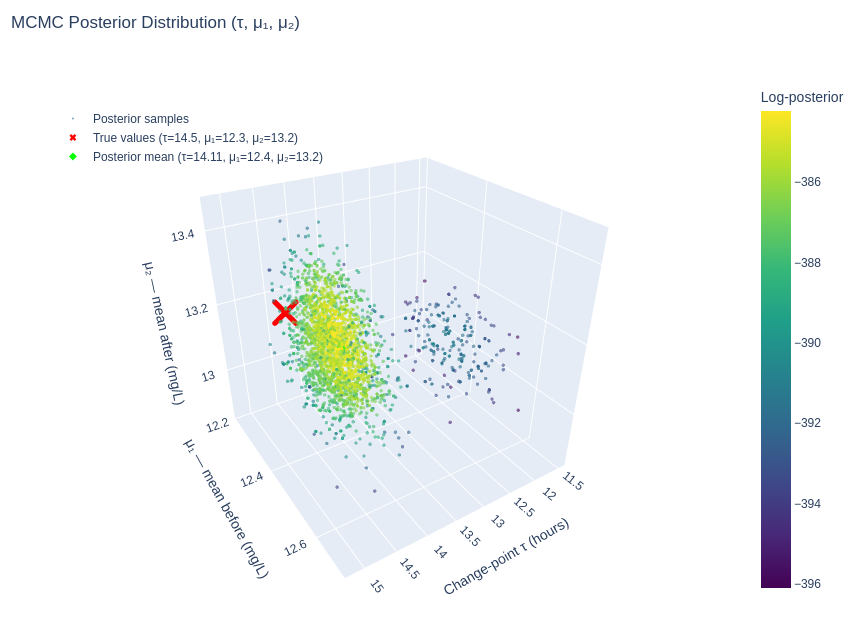

# Change-Point Detection Using the Metropolis Algorithm

Companion script to the [metropolis-algorithm.com](metropolis-algorithm.com) website.

Bayesian change-point detection using the Metropolis algorithm. Given noisy time-series observations, the script infers when a change occurred and what the parameters were before and after the change.

## The Problem

Imagine that the levels of dissolved oxygen (mg/L) in stream water are sampled at random over a 24 hour period. At some unknown time, the mean oxygen level shifts. We observe noisy measurements but don't know:

- When the change happened (the change-point time, $\tau$)
- What the mean oxygen level was before ($\mu_1$) and after ($\mu_2$) the change

## Installation

Requires Python and [uv](https://docs.astral.sh/uv/).

```sh
git clone <repo-url>
cd mhcpd
uv sync
```

## Usage

```sh
uv run main.py
```

Results are printed to the terminal and 2D plots are saved to `output/results.png`.

An interactive 3D visualisation of the joint posterior distribution ($\tau$, $\mu_1$, $\mu_2$) is saved to `output/posterior_3d.html`. Open it in a browser to pan, zoom, and rotate.



## Dependencies

- [NumPy](https://numpy.org/) -- numerical computation
- [Matplotlib](https://matplotlib.org/) -- plotting
- [Plotly](https://plotly.com/python/) -- interactive 3D visualisation

## License

[MIT](LICENSE)
